# 📐 UML-CLASS-DIAGRAM.md — Class Diagram

Related: `05-ARCHITECTURE.md`, `06-DESIGN-PATTERNS.md`. Rendered in Mermaid (view in GitHub/most Markdown previewers, or paste into mermaid.live).

> **Updated 31 Jul 2026** post-customer-meeting: added `Account`, `AccountController`, `AccountService`, `AccountRepository`, `AnalyticsController`/`AnalyticsService`, and `RateLimitFilter` — MEM-017/019/020.

## 1. Full Class Diagram

```mermaid
classDiagram
    direction TB

    %% ===== Cross-cutting =====
    class RateLimitFilter {
        -Bucket globalBucket
        -Map~String, Bucket~ perClientBuckets
        +doFilter(request, response, chain) void
    }

    %% ===== API Layer =====
    class PaymentController {
        -PaymentService paymentService
        +create(CreatePaymentRequest) ResponseEntity~PaymentResponse~
        +getById(UUID id) ResponseEntity~PaymentResponse~
        +list(PaymentStatus status, Pageable) ResponseEntity~Page~PaymentResponse~~
        +getHistory(UUID id) ResponseEntity~List~PaymentHistoryResponse~~
        +validatePayment(UUID id) ResponseEntity~PaymentResponse~
        +sendPayment(UUID id) ResponseEntity~PaymentResponse~
        +completePayment(UUID id) ResponseEntity~PaymentResponse~
    }

    class AccountController {
        -AccountService accountService
        +list() ResponseEntity~List~AccountResponse~~
        +getById(UUID id) ResponseEntity~AccountResponse~
    }

    class AnalyticsController {
        -AnalyticsService analyticsService
        +summary() ResponseEntity~KpiSummaryResponse~
        +trend() ResponseEntity~TrendResponse~
    }

    class CreatePaymentRequest {
        +UUID sourceAccountId
        +BigDecimal amount
        +String currency
        +String destinationAccount
        +String reference
        +String idempotencyKey
    }

    class PaymentResponse {
        +UUID id
        +BigDecimal amount
        +String currency
        +UUID sourceAccountId
        +String destinationAccount
        +String reference
        +PaymentStatus status
        +String errorCode
        +String errorMessage
        +Instant createdAt
        +Instant updatedAt
    }

    class PaymentHistoryResponse {
        +UUID id
        +PaymentStatus previousStatus
        +PaymentStatus newStatus
        +String errorCode
        +String errorMessage
        +String triggeredBy
        +Instant occurredAt
    }

    class AccountResponse {
        +UUID id
        +String label
        +String accountNumber
        +String currency
        +String status
    }

    class KpiSummaryResponse {
        +long totalPayments
        +double successRatePct
        +double failureRatePct
        +double avgProcessingTimeSeconds
        +double throughputPerMinute
        +Map~String, BigDecimal~ volumeByCurrency
        +Map~String, Long~ topFailureReasons
    }

    class TrendResponse {
        +List~TrendBucket~ buckets
    }

    class PaymentMapper {
        <<interface>>
        +toEntity(CreatePaymentRequest) Payment
        +toResponse(Payment) PaymentResponse
        +toHistoryResponse(PaymentStatusHistory) PaymentHistoryResponse
    }

    class AccountMapper {
        <<interface>>
        +toResponse(Account) AccountResponse
    }

    class GlobalExceptionHandler {
        +handlePaymentNotFound(PaymentNotFoundException) ResponseEntity~ApiError~
        +handleAccountNotFound(AccountNotFoundException) ResponseEntity~ApiError~
        +handleInvalidTransition(InvalidStatusTransitionException) ResponseEntity~ApiError~
        +handleValidation(MethodArgumentNotValidException) ResponseEntity~ApiError~
        +handleRateLimitExceeded(RateLimitExceededException) ResponseEntity~ApiError~
        +handleGeneric(Exception) ResponseEntity~ApiError~
    }

    class ApiError {
        +String errorCode
        +String message
        +Instant timestamp
        +String path
    }

    %% ===== Business Logic Layer =====
    class PaymentService {
        -PaymentRepository paymentRepository
        -PaymentStatusHistoryRepository historyRepository
        -IdempotencyService idempotencyService
        -AccountService accountService
        -StatusTransitionEngine transitionEngine
        -PaymentMapper mapper
        +createPayment(CreatePaymentRequest) Payment
        +getById(UUID) Payment
        +list(PaymentStatus, Pageable) Page~Payment~
        +getHistory(UUID) List~PaymentStatusHistory~
        +triggerValidate(UUID) Payment
        +triggerSend(UUID) Payment
        +triggerComplete(UUID) Payment
    }

    class AccountService {
        -AccountRepository accountRepository
        +getActiveAccount(UUID id) Account
        +listAll() List~Account~
    }

    class AnalyticsService {
        -PaymentRepository paymentRepository
        -PaymentStatusHistoryRepository historyRepository
        +computeSummary(Instant from, Instant to) KpiSummaryResponse
        +computeTrend(int hours) TrendResponse
    }

    class IdempotencyService {
        -PaymentRepository paymentRepository
        +findExisting(String idempotencyKey) Optional~Payment~
    }

    class StatusTransitionEngine {
        -Map~PaymentStatus, PaymentState~ states
        -ValidationChain validationChain
        -PaymentStatusHistoryRepository historyRepository
        +validate(Payment) Payment
        +send(Payment) Payment
        +complete(Payment) Payment
        -recordHistory(Payment, PaymentStatus previous, PaymentStatus next, ValidationError err) void
    }

    class PaymentState {
        <<interface>>
        +status() PaymentStatus
        +validate(Payment, ValidationChain) TransitionResult
        +send(Payment) TransitionResult
        +complete(Payment) TransitionResult
    }

    class CreatedState {
        +validate(Payment, ValidationChain) TransitionResult
        +send(Payment) TransitionResult
        +complete(Payment) TransitionResult
    }
    class ValidatedState {
        +validate(Payment, ValidationChain) TransitionResult
        +send(Payment) TransitionResult
        +complete(Payment) TransitionResult
    }
    class SentState {
        +validate(Payment, ValidationChain) TransitionResult
        +send(Payment) TransitionResult
        +complete(Payment) TransitionResult
    }
    class CompletedState {
        +validate(Payment, ValidationChain) TransitionResult
        +send(Payment) TransitionResult
        +complete(Payment) TransitionResult
    }
    class FailedState {
        +validate(Payment, ValidationChain) TransitionResult
        +send(Payment) TransitionResult
        +complete(Payment) TransitionResult
    }

    class TransitionResult {
        +PaymentStatus newStatus
        +String errorCode
        +String errorMessage
        +boolean success
    }

    class ValidationChain {
        -List~PaymentValidator~ validators
        +runAll(Payment) List~ValidationError~
    }

    class PaymentValidator {
        <<interface>>
        +validate(Payment) Optional~ValidationError~
    }

    class AmountValidator {
        +validate(Payment) Optional~ValidationError~
    }
    class CurrencyValidator {
        -Set~String~ supportedCurrencies
        +validate(Payment) Optional~ValidationError~
    }
    class AccountValidator {
        -AccountService accountService
        +validate(Payment) Optional~ValidationError~
    }

    class ValidationError {
        +String errorCode
        +String message
    }

    %% ===== Domain / Entities =====
    class Account {
        +UUID id
        +String label
        +String accountNumber
        +String currency
        +String status
        +Instant createdAt
    }

    class Payment {
        +UUID id
        +BigDecimal amount
        +String currency
        +UUID sourceAccountId
        +String destinationAccount
        +String reference
        +PaymentStatus status
        +String errorCode
        +String errorMessage
        +String idempotencyKey
        +Instant createdAt
        +Instant updatedAt
        +Long version
    }

    class PaymentStatusHistory {
        +UUID id
        +UUID paymentId
        +PaymentStatus previousStatus
        +PaymentStatus newStatus
        +String errorCode
        +String errorMessage
        +String triggeredBy
        +Instant occurredAt
    }

    class PaymentStatus {
        <<enumeration>>
        CREATED
        VALIDATED
        SENT
        COMPLETED
        FAILED
    }

    %% ===== Data Access Layer =====
    class PaymentRepository {
        <<interface>>
        +findByIdempotencyKey(String) Optional~Payment~
        +findByStatus(PaymentStatus, Pageable) Page~Payment~
        +findByReferenceContaining(String, Pageable) Page~Payment~
        +findBySourceAccountId(UUID) List~Payment~
    }

    class PaymentStatusHistoryRepository {
        <<interface>>
        +findByPaymentIdOrderByOccurredAtAsc(UUID) List~PaymentStatusHistory~
    }

    class AccountRepository {
        <<interface>>
        +findByStatus(String) List~Account~
        +findByAccountNumber(String) Optional~Account~
    }

    %% ===== Relationships =====
    RateLimitFilter ..> PaymentController
    RateLimitFilter ..> AccountController
    RateLimitFilter ..> AnalyticsController

    PaymentController --> PaymentService
    PaymentController --> PaymentMapper
    PaymentController ..> CreatePaymentRequest
    PaymentController ..> PaymentResponse
    PaymentController ..> PaymentHistoryResponse
    AccountController --> AccountService
    AccountController --> AccountMapper
    AccountController ..> AccountResponse
    AnalyticsController --> AnalyticsService
    AnalyticsController ..> KpiSummaryResponse
    AnalyticsController ..> TrendResponse
    GlobalExceptionHandler ..> ApiError

    PaymentService --> PaymentRepository
    PaymentService --> PaymentStatusHistoryRepository
    PaymentService --> IdempotencyService
    PaymentService --> AccountService
    PaymentService --> StatusTransitionEngine
    PaymentService --> PaymentMapper

    AccountService --> AccountRepository
    AnalyticsService --> PaymentRepository
    AnalyticsService --> PaymentStatusHistoryRepository

    IdempotencyService --> PaymentRepository

    StatusTransitionEngine --> PaymentState
    StatusTransitionEngine --> ValidationChain
    StatusTransitionEngine --> PaymentStatusHistoryRepository
    StatusTransitionEngine ..> TransitionResult

    PaymentState <|.. CreatedState
    PaymentState <|.. ValidatedState
    PaymentState <|.. SentState
    PaymentState <|.. CompletedState
    PaymentState <|.. FailedState

    ValidationChain --> PaymentValidator
    PaymentValidator <|.. AmountValidator
    PaymentValidator <|.. CurrencyValidator
    PaymentValidator <|.. AccountValidator
    AccountValidator --> AccountService
    ValidationChain ..> ValidationError

    PaymentMapper ..> Payment
    PaymentMapper ..> PaymentStatusHistory
    AccountMapper ..> Account

    Payment --> PaymentStatus
    PaymentStatusHistory --> PaymentStatus
    PaymentRepository ..> Payment
    PaymentStatusHistoryRepository ..> PaymentStatusHistory
    AccountRepository ..> Account
    Payment "1" --> "many" PaymentStatusHistory : has history
    Account "1" --> "many" Payment : is source of
```

## 2. Notes on Diagram Choices

- **`PaymentState` is an interface** (not abstract class) — each concrete state (`CreatedState`, etc.) only implements the transitions relevant to it; illegal ones return a failed `TransitionResult` (or the engine intercepts before calling, per implementation detail decided during coding) rather than every state needing to override every method with an exception-throwing stub. Exact mechanic (return-failure vs. throw) is a Sprint 1 implementation nuance — either is consistent with this diagram's shape.
- **`StatusTransitionEngine` is the single orchestrator** — it holds the map of `PaymentStatus → PaymentState` and is the one place that decides which state handles the current request, then persists the result + audit row atomically.
- **`ValidationChain` + `PaymentValidator`** shown as composition — Spring will inject `List<PaymentValidator>` automatically into `ValidationChain`'s constructor (all concrete validators, including the new `AccountValidator`, are Spring beans).
- **DTOs (`CreatePaymentRequest`, `PaymentResponse`, `PaymentHistoryResponse`, `AccountResponse`, `KpiSummaryResponse`) never touch the Business Logic or Data layers directly** — only the mappers bridge them, enforcing the architecture boundary from Phase 2.
- **`Payment` 1-to-many `PaymentStatusHistory`** — modeled as a JPA `@OneToMany` (mapped by `payment_id` FK) for query convenience, though the history repository can also be queried independently without loading the parent (avoids N+1/lazy-loading pitfalls — repository method `findByPaymentIdOrderByOccurredAtAsc` is the primary access path, not entity graph traversal).
- **`Account` 1-to-many `Payment`** *(new, MEM-017)* — a `Payment.sourceAccountId` is a plain FK column (not a full JPA `@ManyToOne` object reference) to keep `Payment` reads cheap (no join needed unless the account detail is actually requested) — `AccountService` resolves the account only when validating or when the frontend explicitly asks for account details.
- **`RateLimitFilter`** *(new, MEM-020)* sits in front of all three controllers as a servlet filter, not a Spring bean the controllers call directly — shown here with a dependency arrow purely to convey "runs before," not a runtime object reference.
- **`AnalyticsService`** *(new, MEM-019)* reads directly from `PaymentRepository`/`PaymentStatusHistoryRepository` via aggregation queries — it does not introduce a separate write model or event store (see `06-DESIGN-PATTERNS.md` "Why this combination").

