# 🔁 UML-SEQUENCE-DIAGRAMS.md — Sequence Diagrams

Related: `08-UML-CLASS-DIAGRAM.md`, `05-ARCHITECTURE.md` §3 (request flow narrative). Rendered in Mermaid.

> **Updated 31 Jul 2026** post-customer-meeting: diagram 1 updated for account selection; new diagrams 8 (Rate Limit Exceeded) and 9 (KPI Dashboard fetch) added — MEM-017/019/020.

## 1. Create Payment — Happy Path (auto-progresses to COMPLETED, now with Account selection)

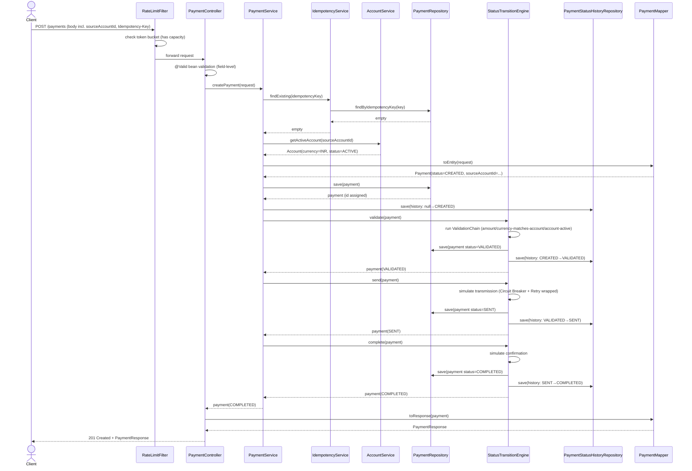

## 2. Create Payment — Duplicate Idempotency Key (MEM-006)

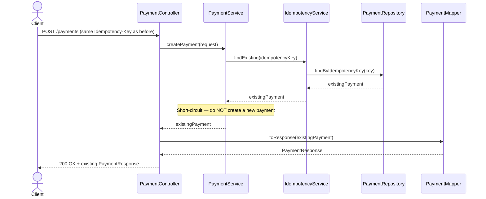

## 3. Failure Path — Validation Fails at CREATED→VALIDATED

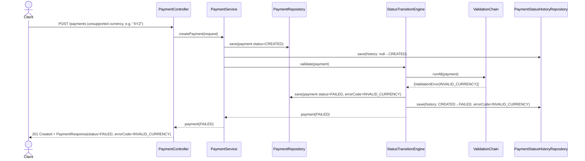

> Note: creation itself still returns `201` (the *resource* was created successfully) — it's the payment's *status* that reflects `FAILED`. Client inspects `status`/`errorCode` in the response body, consistent with FR-1.4 Option (b) and NFR-6 (consistent error contract for business-rule failures, as opposed to `400` for pure request-shape validation).

## 4. Failure Path — Simulated Network Error at SENT stage

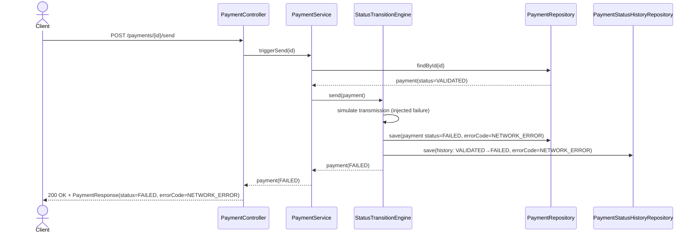

## 5. Illegal Transition Attempt (Rejected)

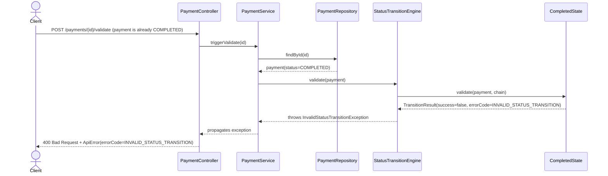

## 6. Get Payment Details + History (Read Path)

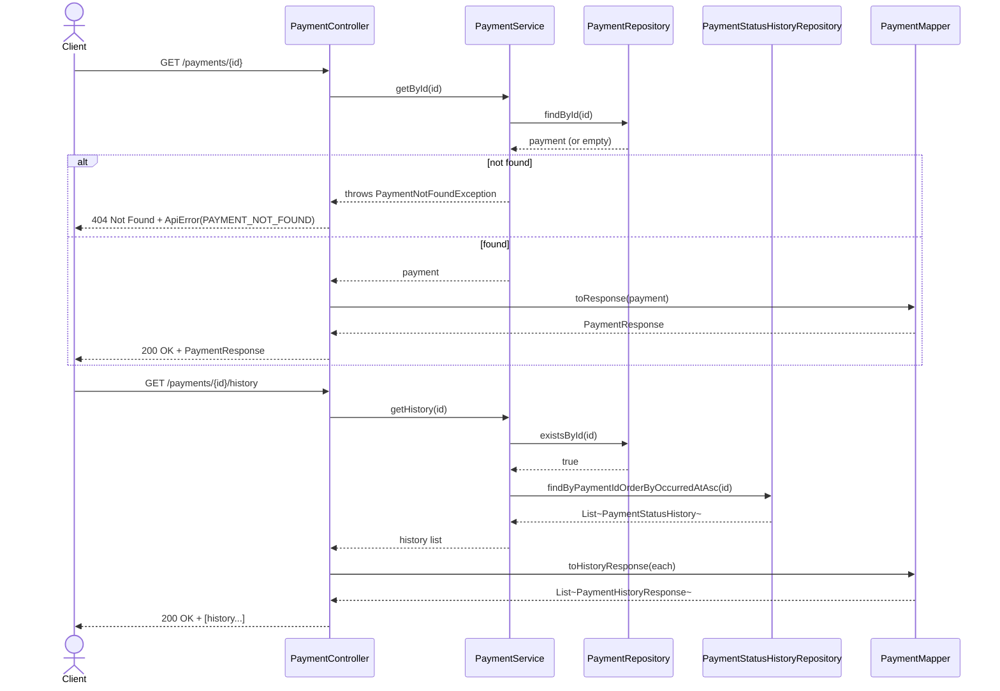

## 7. List/Search/Filter Payments

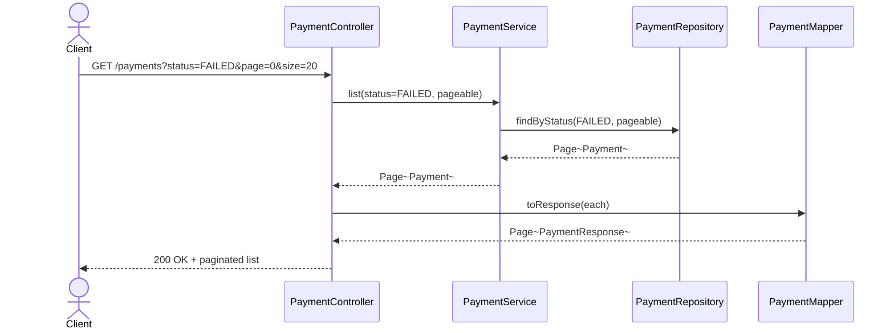

## 8. Rate Limit Exceeded (new, MEM-020)

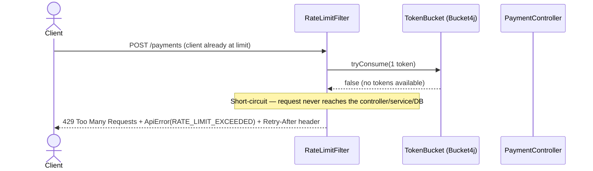

> This is deliberately the **cheapest possible rejection point** in the whole architecture (§4 of `05-ARCHITECTURE.md`) — no DB connection, no service logic, no business validation is spent on a request that's going to be rejected anyway.

## 9. KPI Dashboard Fetch (new, MEM-019)

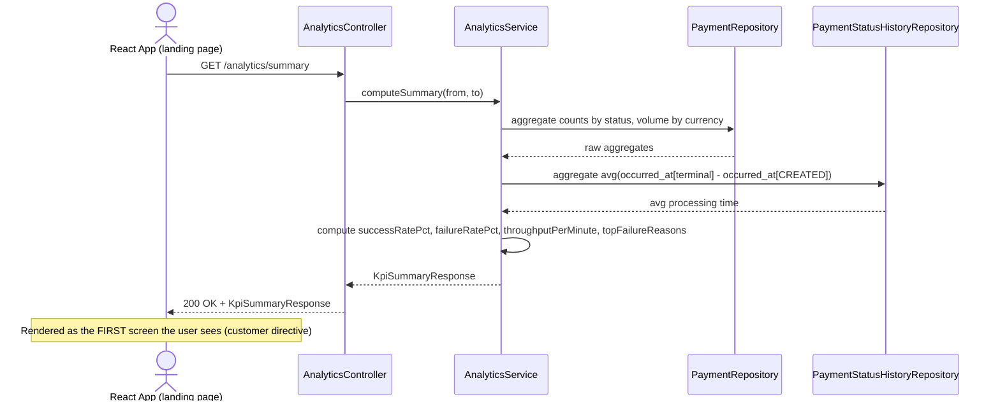

---

## V2 Sequence Diagrams (05 Aug 2026 — MEM-023–034)

## 10. Notification Dispatch on Payment Completion (new, MEM-025/026)

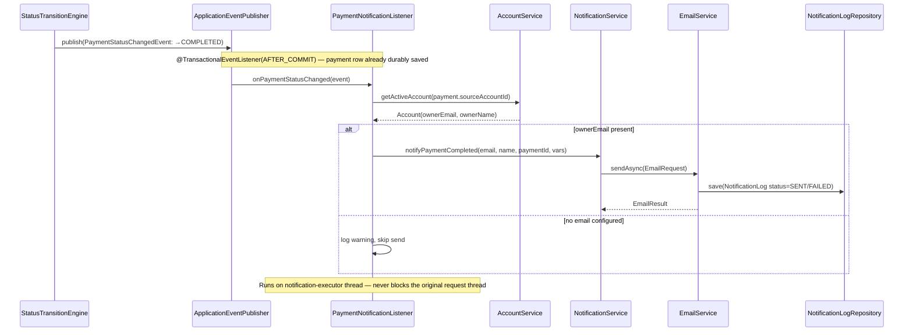

## 11. Payment Cancellation (new, feature #18, MEM-029)

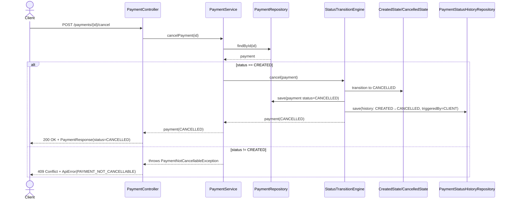

## 12. Payment Reversal (new, feature #19, MEM-030)

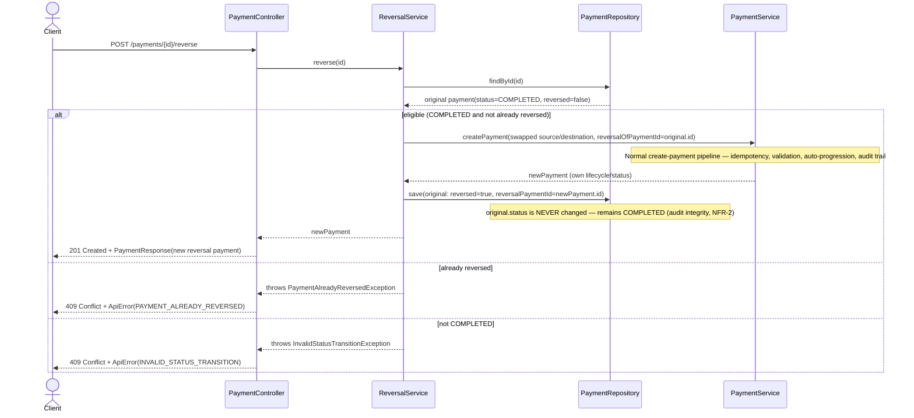

## 13. Dashboard Live Update via SSE (new, MEM-027)

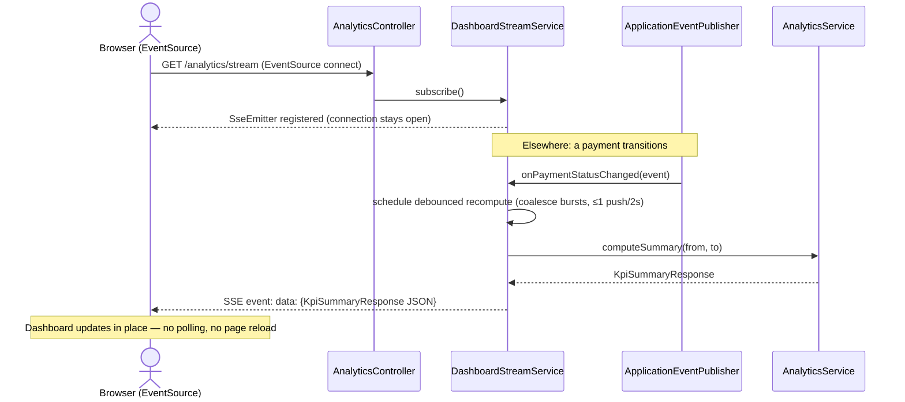

## 14. CSV Export (new, feature #14, MEM-032)

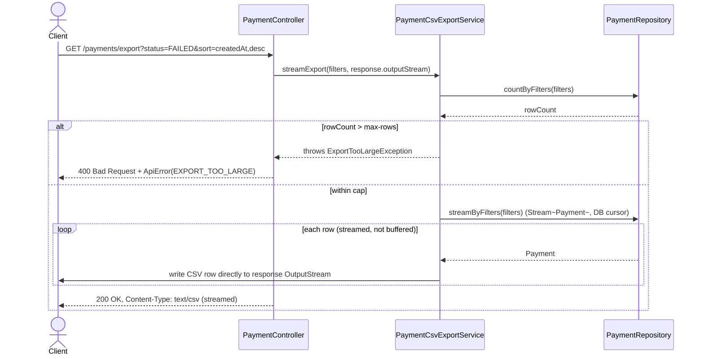

