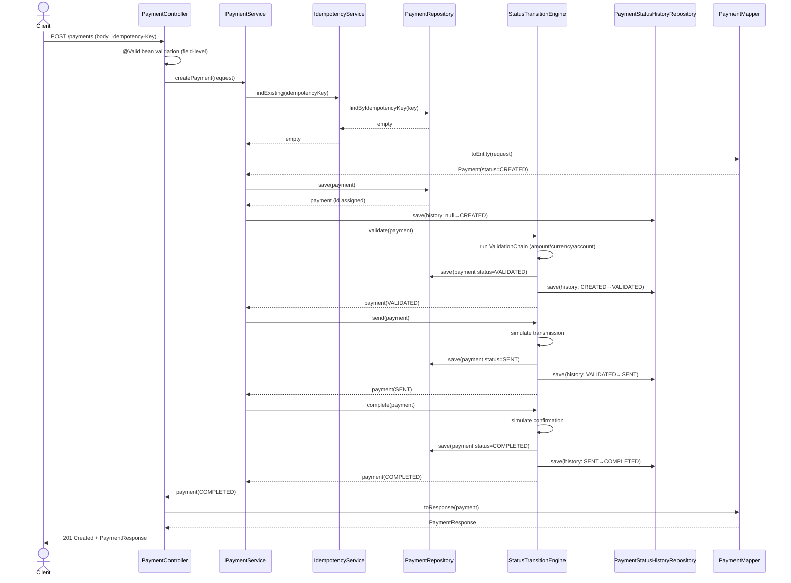
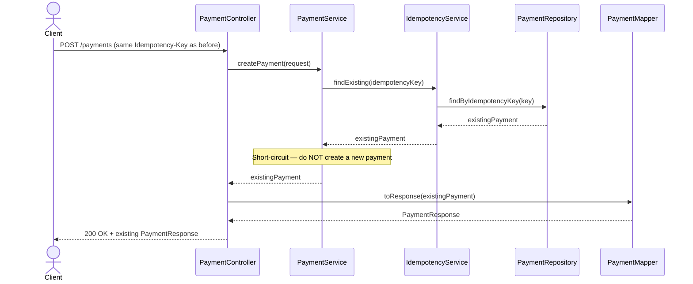
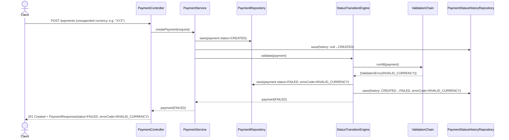
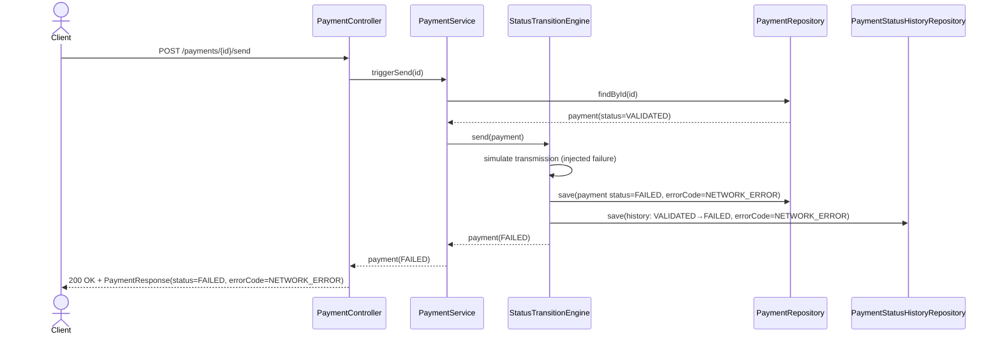
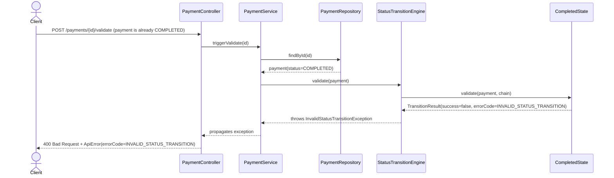
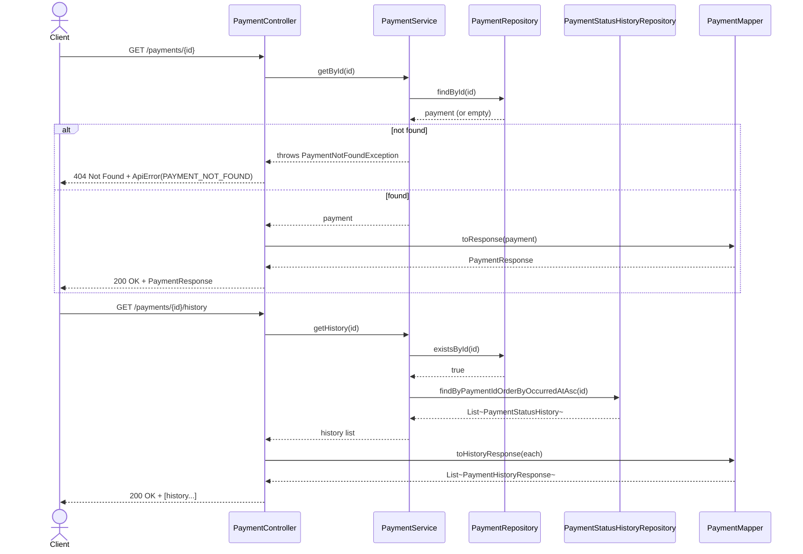
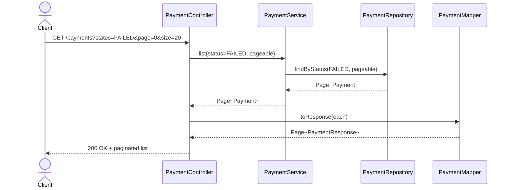

# 🔁 UML-SEQUENCE-DIAGRAMS.md — Sequence Diagrams

Related: `08-UML-CLASS-DIAGRAM.md`, `05-ARCHITECTURE.md` §3 (request flow narrative). Rendered in Mermaid.

## 1. Create Payment — Happy Path (auto-progresses to COMPLETED)

## 2. Create Payment — Duplicate Idempotency Key (MEM-006)

## 3. Failure Path — Validation Fails at CREATED→VALIDATED

> Note: creation itself still returns `201` (the *resource* was created successfully) — it's the payment's *status* that reflects `FAILED`. Client inspects `status`/`errorCode` in the response body, consistent with FR-1.4 Option (b) and NFR-6 (consistent error contract for business-rule failures, as opposed to `400` for pure request-shape validation).

## 4. Failure Path — Simulated Network Error at SENT stage

## 5. Illegal Transition Attempt (Rejected)

## 6. Get Payment Details + History (Read Path)

## 7. List/Search/Filter Payments

