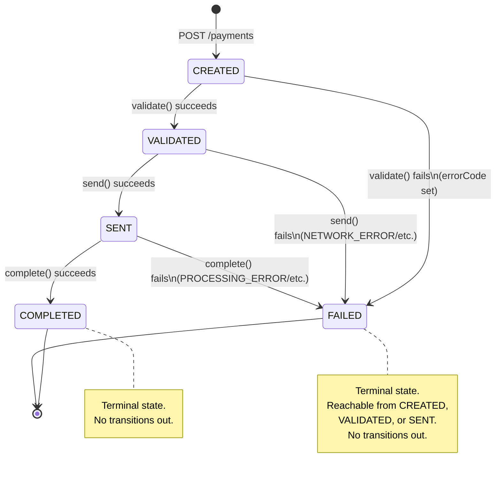
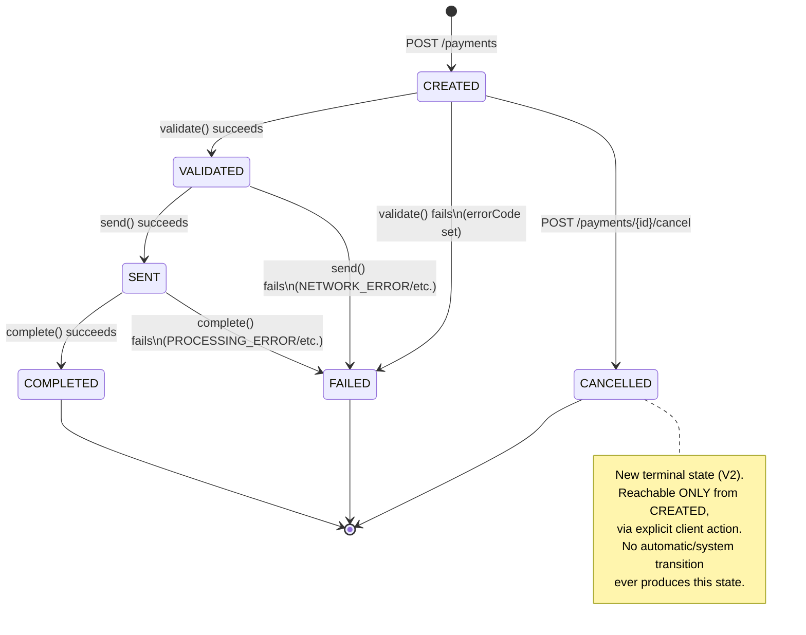

# 🔀 UML-STATE-DIAGRAM.md — Payment Status State Machine

Related: `04-SRS.md` FR-10, `06-DESIGN-PATTERNS.md` #1 (State Pattern), `08-UML-CLASS-DIAGRAM.md` (`PaymentState` hierarchy).

## 1. State Diagram

## 2. Transition Table (authoritative — matches SRS FR-10 / brief Appendix C exactly)

| From \ To | CREATED | VALIDATED | SENT | COMPLETED | FAILED |
|---|---|---|---|---|---|
| **CREATED** | ❌ | ✅ | ❌ | ❌ | ✅ |
| **VALIDATED** | ❌ | ❌ | ✅ | ❌ | ✅ |
| **SENT** | ❌ | ❌ | ❌ | ✅ | ✅ |
| **COMPLETED** | ❌ | ❌ | ❌ | ❌ | ❌ (terminal) |
| **FAILED** | ❌ | ❌ | ❌ | ❌ | ❌ (terminal) |

Any ❌ cell attempted at runtime → `InvalidStatusTransitionException` → `400 INVALID_STATUS_TRANSITION` (per Error Code Contract, `04-SRS.md` §6).

## 3. Mapping to State Pattern Classes

| State (enum value) | Class | Legal outgoing transitions it implements |
|---|---|---|
| `CREATED` | `CreatedState` | → `VALIDATED` (validate success), → `FAILED` (validate failure) |
| `VALIDATED` | `ValidatedState` | → `SENT` (send success), → `FAILED` (send failure) |
| `SENT` | `SentState` | → `COMPLETED` (complete success), → `FAILED` (complete failure) |
| `COMPLETED` | `CompletedState` | none — all methods return/throw "illegal transition" |
| `FAILED` | `FailedState` | none — all methods return/throw "illegal transition" |

## 4. Design Note — Why explicit terminal states instead of a generic guard?

Using dedicated `CompletedState`/`FailedState` classes (rather than a single `if (isTerminal(status)) throw` guard scattered elsewhere) keeps **all** transition knowledge inside the State pattern's classes — consistent with the Class Diagram and easy to extend later (e.g. if a future "Payment Reversal" stretch feature, Appendix E, ever needed to add a legal transition OUT of `COMPLETED`, it's a one-class change, not a hunt through guard conditions across the codebase).

## 5. `Account` Status — Deliberately NOT a State Machine (new, MEM-017)

`Account.status` (`ACTIVE` / `INACTIVE`) is a simple flag, not a finite state machine — there's no lifecycle of transitions to enforce (no "pending", no automatic progression). It's checked as a **guard condition** by `AccountValidator` when a payment is created (an `INACTIVE` account cannot be used as a payment source), but it does not participate in the `PaymentState` hierarchy above. Keeping it a plain enum/flag rather than a second State-pattern hierarchy avoids over-engineering a concept that doesn't need one — consistent with the brief's "start small" guidance, now reapplied to the newly-added `Account` entity.

---

## 6. V2 State Machine Update — `CANCELLED` added (05 Aug 2026, feature #18, MEM-029)

### 6.1 Updated Transition Table

| From \ To | CREATED | VALIDATED | SENT | COMPLETED | FAILED | CANCELLED |
|---|---|---|---|---|---|---|
| **CREATED** | ❌ | ✅ | ❌ | ❌ | ✅ | ✅ |
| **VALIDATED** | ❌ | ❌ | ✅ | ❌ | ✅ | ❌ |
| **SENT** | ❌ | ❌ | ❌ | ✅ | ✅ | ❌ |
| **COMPLETED** | ❌ | ❌ | ❌ | ❌ (terminal) | ❌ | ❌ |
| **FAILED** | ❌ | ❌ | ❌ | ❌ | ❌ (terminal) | ❌ |
| **CANCELLED** | ❌ | ❌ | ❌ | ❌ | ❌ | ❌ (terminal) |

Implemented as a new `CancelledState` class alongside the existing 5, per `08-UML-CLASS-DIAGRAM.md` §3 — zero changes to `StatusTransitionEngine`'s dispatch mechanism (Open/Closed, MEM-029).

### 6.2 Payment Reversal (#19) — deliberately NOT a state transition

Per MEM-030, reversing a `COMPLETED` payment does **not** add a `REVERSED` state or any outgoing transition from `COMPLETED` (which remains strictly terminal, unchanged from Core). Instead, reversal is modeled as: (a) a `reversed` boolean flag flipped on the original payment, and (b) a **brand-new**, independent `Payment` row (with `reversalOfPaymentId` linking back) that goes through this **exact same** state diagram from `CREATED` onward, like any other payment. This preserves the original state machine's documented terminal-state guarantee ("no scenario ever leaves `COMPLETED`") while still delivering the reversal feature.

