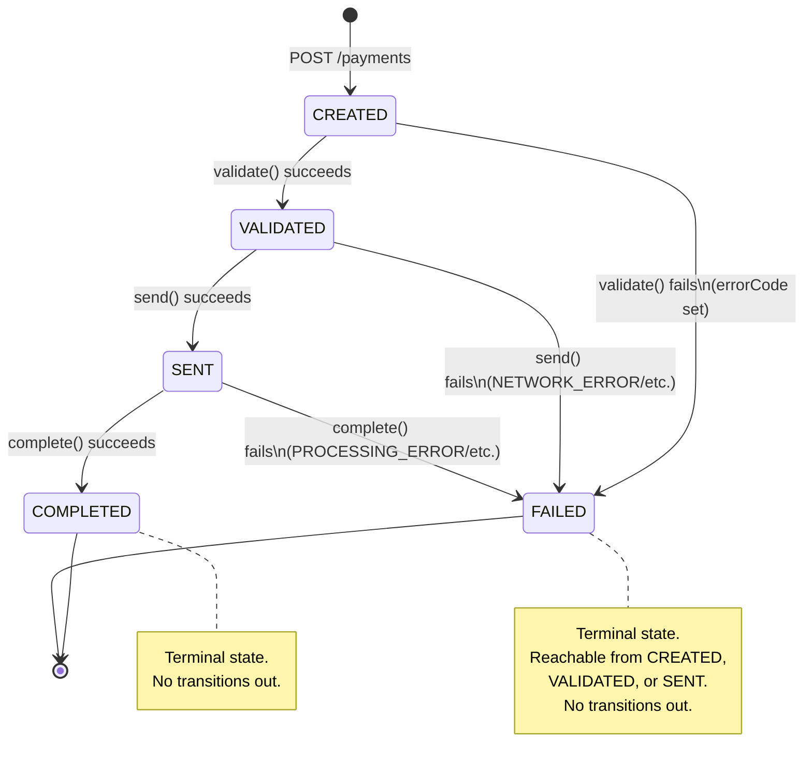

# 🔀 UML-STATE-DIAGRAM.md — Payment Status State Machine

Related: `04-SRS.md` FR-10, `06-DESIGN-PATTERNS.md` #1 (State Pattern), `08-UML-CLASS-DIAGRAM.md` (`PaymentState` hierarchy).

## 1. State Diagram

## 2. Transition Table (authoritative — matches SRS FR-10 / brief Appendix C exactly)

| From \ To | CREATED | VALIDATED | SENT | COMPLETED | FAILED |
|---|---|---|---|---|---|
| **CREATED** | ❌ | ✅ | ❌ | ❌ | ✅ |
| **VALIDATED** | ❌ | ❌ | ✅ | ❌ | ✅ |
| **SENT** | ❌ | ❌ | ❌ | ✅ | ✅ |
| **COMPLETED** | ❌ | ❌ | ❌ | ❌ | ❌ (terminal) |
| **FAILED** | ❌ | ❌ | ❌ | ❌ | ❌ (terminal) |

Any ❌ cell attempted at runtime → `InvalidStatusTransitionException` → `400 INVALID_STATUS_TRANSITION` (per Error Code Contract, `04-SRS.md` §6).

## 3. Mapping to State Pattern Classes

| State (enum value) | Class | Legal outgoing transitions it implements |
|---|---|---|
| `CREATED` | `CreatedState` | → `VALIDATED` (validate success), → `FAILED` (validate failure) |
| `VALIDATED` | `ValidatedState` | → `SENT` (send success), → `FAILED` (send failure) |
| `SENT` | `SentState` | → `COMPLETED` (complete success), → `FAILED` (complete failure) |
| `COMPLETED` | `CompletedState` | none — all methods return/throw "illegal transition" |
| `FAILED` | `FailedState` | none — all methods return/throw "illegal transition" |

## 4. Design Note — Why explicit terminal states instead of a generic guard?

Using dedicated `CompletedState`/`FailedState` classes (rather than a single `if (isTerminal(status)) throw` guard scattered elsewhere) keeps **all** transition knowledge inside the State pattern's classes — consistent with the Class Diagram and easy to extend later (e.g. if a future "Payment Reversal" stretch feature, Appendix E, ever needed to add a legal transition OUT of `COMPLETED`, it's a one-class change, not a hunt through guard conditions across the codebase).

